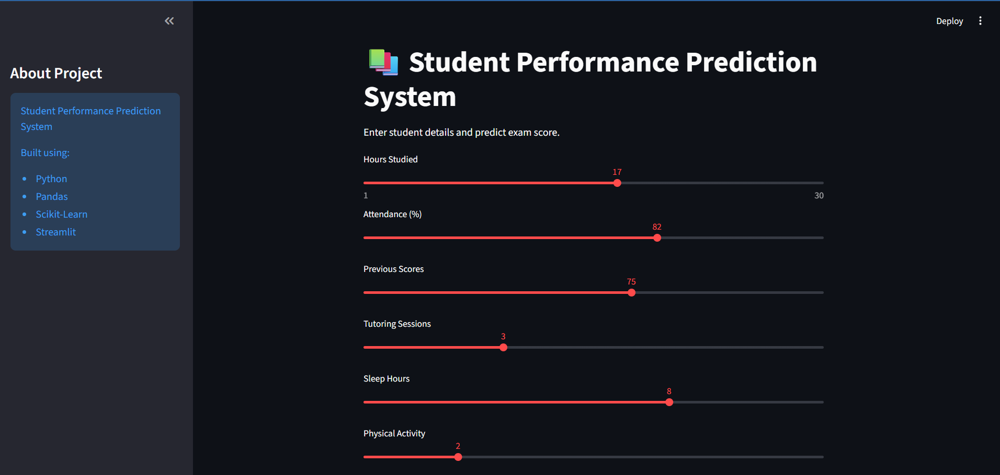

# 🎓 Student Performance Prediction System

A Machine Learning project that predicts student exam performance based on various academic, personal, and environmental factors.

## 📌 Project Overview

The Student Performance Prediction System uses Machine Learning algorithms to predict a student's exam score using factors such as:

- Hours Studied
- Attendance
- Previous Scores
- Tutoring Sessions
- Sleep Hours
- Physical Activity
- Family Background
- Teacher Quality
- Motivation Level
- Access to Resources

The goal of this project is to analyze the factors affecting student performance and accurately predict exam scores.

---

## 🚀 Features

✅ Data Cleaning and Preprocessing

✅ Exploratory Data Analysis (EDA)

✅ Correlation Analysis

✅ Feature Importance Analysis

✅ Linear Regression Model

✅ Random Forest Regressor Comparison

✅ Model Evaluation using MAE, MSE, and R² Score

✅ Model Serialization using Pickle

✅ Interactive Streamlit Web Application

✅ Student Score Prediction Interface

---

## 🛠️ Technologies Used

- Python
- Pandas
- NumPy
- Matplotlib
- Seaborn
- Scikit-Learn
- Streamlit
- Pickle

---

## 📂 Project Structure

```text
student-performance-prediction-system/
│
├── app/
│   └── app.py
│
├── data/
│   ├── StudentPerformanceFactors.csv
│   └── cleaned_student_data.csv
│
├── images/
│   ├── distribution_of_exam_scores.png
│   ├── attendance_vs_exam_score.png
│   ├── hours_studied_vs_exam_score.png
│   ├── correlation_heatmap.png
│   └── feature_importance.png
│
├── models/
│   └── student_performance_model.pkl
│
├── notebooks/
│   └── student_performance_analysis.ipynb
│
├── requirements.txt
│
└── README.md
```

---

## 📊 Dataset

Dataset used:

**Student Performance Factors Dataset**

The dataset contains information related to academic performance and student behavior.

Target Variable:

```text
Exam_Score
```

Dataset Size:

```text
Rows: 6607
Columns: 20
```

---

## 🔍 Exploratory Data Analysis

The following analyses were performed:

### Distribution of Exam Scores

- Exam scores follow an approximately normal distribution.

### Correlation Analysis

Strongest factors affecting exam scores:

- Attendance
- Hours Studied
- Previous Scores
- Tutoring Sessions

### Feature Importance

Random Forest identified the most influential features:

1. Attendance
2. Hours Studied
3. Previous Scores
4. Tutoring Sessions
5. Sleep Hours

---

## 🤖 Machine Learning Models

### 1. Linear Regression

Performance:

```text
MAE : 1.02
MSE : 4.40
R² Score : 0.689
```

### 2. Random Forest Regressor

Performance:

```text
MAE : 1.13
MSE : 4.88
R² Score : 0.655
```

### Final Model Selected

✅ Linear Regression

Reason:

- Better R² Score
- Lower MAE
- Lower MSE
- Simpler and more interpretable

---

## 🎯 Streamlit Application

The project includes an interactive Streamlit web application where users can:

- Enter student details
- Predict exam score instantly
- View performance feedback

Run the app:

```bash
streamlit run app/app.py
```

or

```bash
python -m streamlit run app/app.py
```

---

## 📈 Results

The model successfully predicts student performance with approximately:

```text
R² Score = 68.88%
```

This indicates that the model explains a significant portion of the variation in student exam scores.

---

## 📸 Screenshots

### Streamlit Application




### Correlation Heatmap


### Feature Importance


---

## 💡 Future Improvements

- Hyperparameter Tuning
- XGBoost Model
- Student Performance Dashboard
- Deployment on Streamlit Cloud
- Real-Time Prediction API

---
